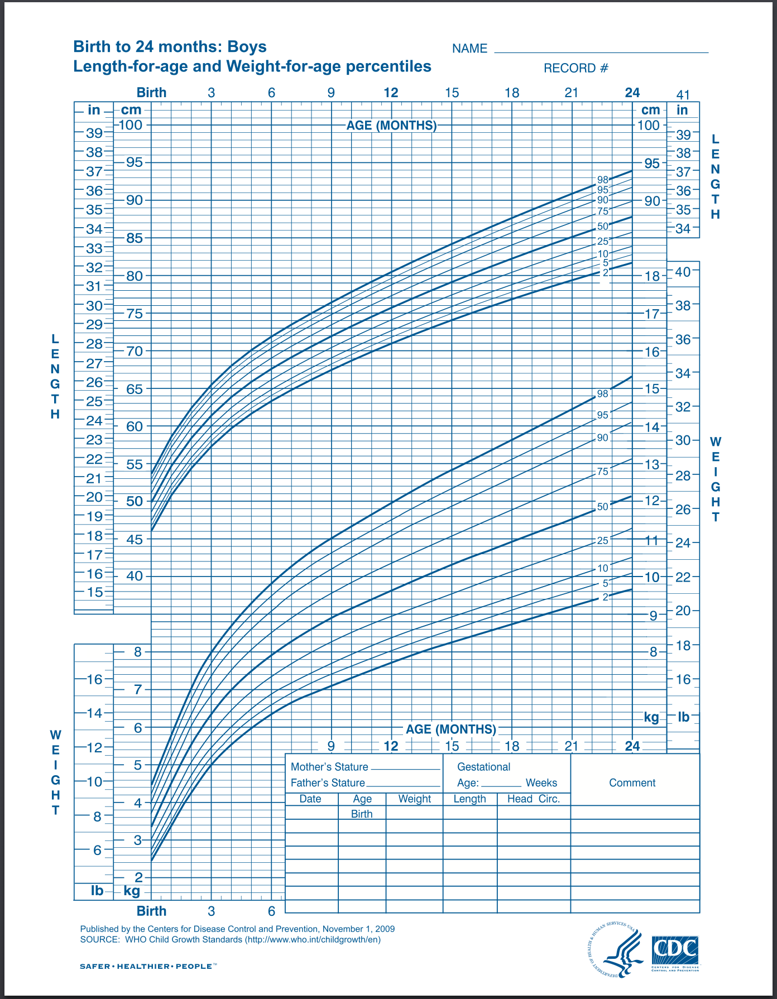
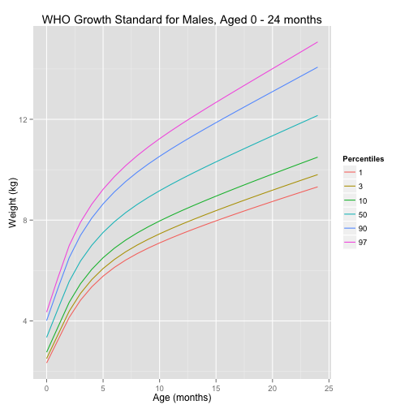
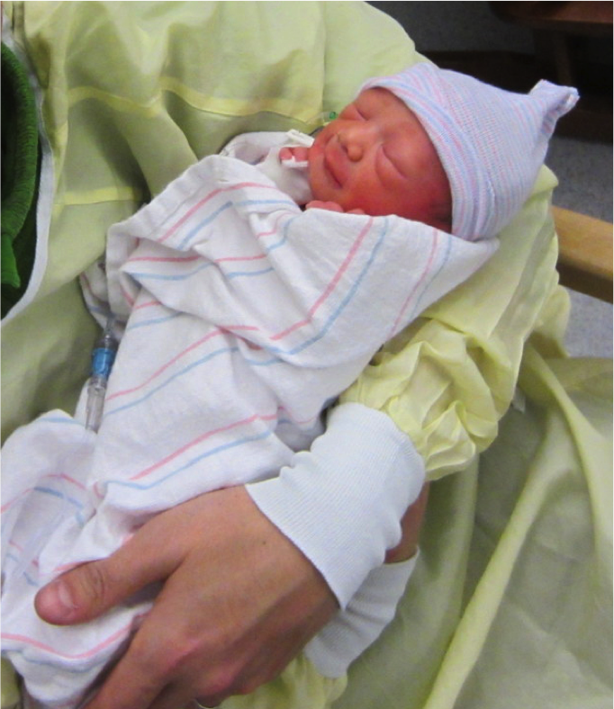

Implementation of the WHO Growth Standard in RStudio Shiny
========================================================
author: Joseph Chou
date: January 17 2015
transition: rotate

Introduction
========================================================

In 2006, the World Health Organization (WHO) released an international growth standard which describes the growth of children living in environments believed to support optimal growth.

Per the CDC, WHO Growth Standards are recommended for use in the U.S. for infants and children 0 to 2 years of age.
***

Why an electronic growth chart?
========================================================

While paper versions of the charts are typically used, the purpose of this Shiny application is to generate an electronic version of the WHO growth charts.

This would allow custom generation of growth charts tailored to specific clinical needs. For example:

- customized choice of percentile curves
    - monitor low percentile growth in cases of severe growth restriction
- zoom into desired portions of the chart
    - monitor head growth in the first 2 months after intracranial hemorrhage

WHO growth chart, generated by R
========================================================

 
***
Generation of this chart was fully automated

Customized addition of the 1%ile curve, not available in the paper chart

Would aid in monitoring growth after severe intrauterine growth restriction.

Future enhancements
========================================================

- plot patient data points
- calculate patient data point percentiles
- provide clinical decision support
- inclusion of other growth charts

***

